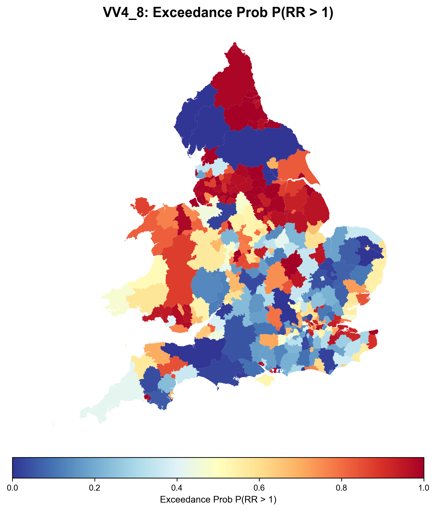
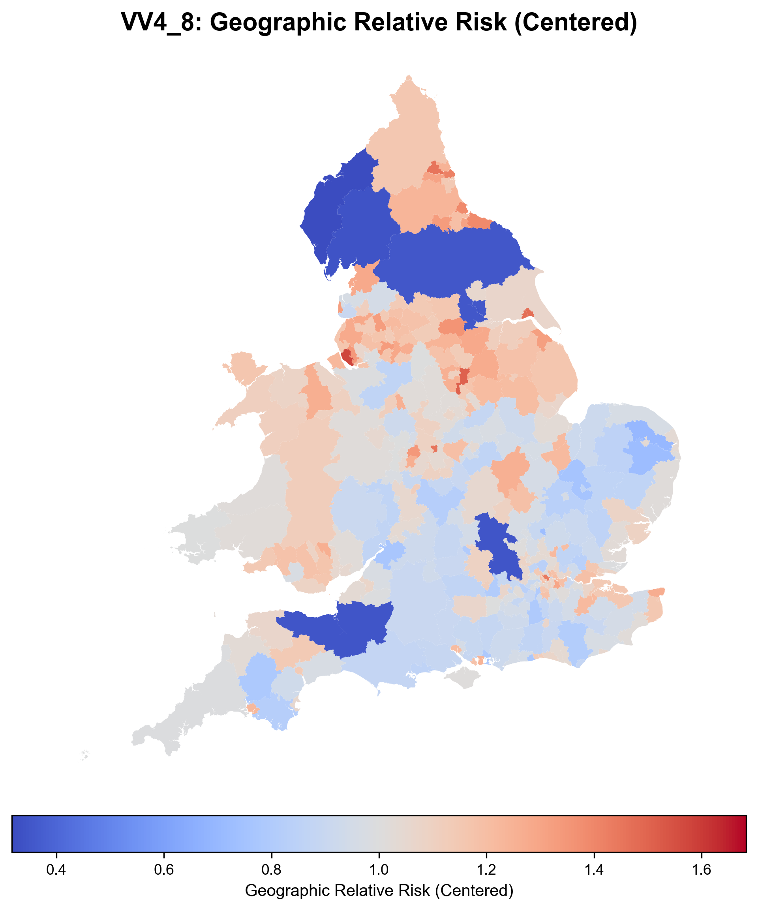
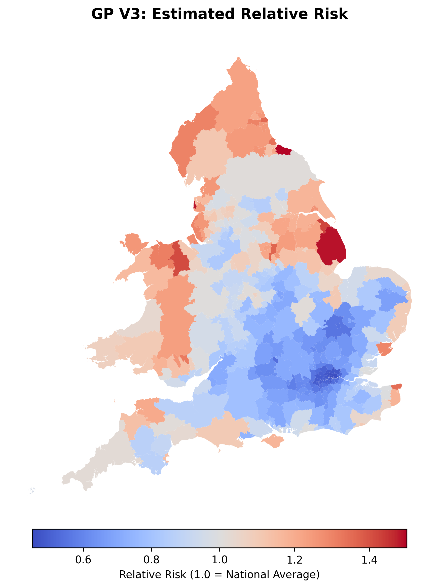

# Modeling Lung Cancer Mortality in the UK using Bayesian GP and CAR Methods🌍

# Interactive Exploration: https://uk-lung-cancer-map.streamlit.app/



⚠️ Researcher Note: This repository is currently in the pre-publication review phase. While the underlying Bayesian models (CAR v4.8 and GP v4.0) are finalized, the scripts and documentation are undergoing a final audit for clarity and optimization.

🤖 Transparency Statement: Agentic AI (Gemini) was utilized as a collaborative partner in this project to assist with LaTeX formatting for poster materials, Python dashboard architecture (Streamlit), and data restructuring processes. All scientific logic and model implementations were verified by the primary researcher.

## Abstract

This project implements a Bayesian spatial epidemiological framework to model lung cancer mortality across the United Kingdom's 318 Local Authority Districts. Utilizing Conditional Autoregressive (CAR) and Gaussian Process (GP) models in JAX and NumPyro, it quantifies spatial risk patterns while accounting for demographic covariates like gender and smoking prevalence, enabling precise identification of high-risk regions for public health interventions.

## Badges


## Status

ENAR 2026 Poster Presentation

**Poster Session Title:** Spatial and Spatiotemporal Data Analysis  
**Poster Session ID#:** 9k  
**Presentation Title:** Comparing Bayesian Conditional Autoregressive and Gaussian Process Spatial Models for Lung Cancer Mortality in the United Kingdom

## Repository Architecture

```
uk-lung-cancer-spatial/
├── 00_legacy/
│   ├── 00_legacy/
│   │   └── aggregated_lung_models/
│   │       ├── agg_car/
│   │       ├── agg_gp/
│   │       ├── CAR_model/
│   │       │   └── plots/
│   │       └── GP_model/
│   │           └── plots/
│   └── Regions-Dec23/
│       └── Regions-Dec2023/
├── data/
│   ├── processed/
│   └── raw/
│       └── Local_Authority_Districts_December_2023_Boundaries_UK_BFC_9042356933902664268/
├── logs/
├── notebooks/
├── outputs/
├── reports/
│   ├── car_reports/
│   │   └── figures/
│   │       └── car_figures/
│   │           ├── car_figures_v3/
│   │           ├── car_figures_v4/
│   │           ├── car_figures_v4_8/
│   │           ├── car_figures_v4.5/
│   │           ├── car_figures_v4.6/
│   │           └── ...
│   └── gp_figures/
├── scripts/
├── src/
│   └── lung_cancer_spatial/
│       ├── inference/
│       ├── models/
│       ├── preprocessing/
│       └── viz/
└── tests/
```

## Table of Contents

- [Abstract](#abstract)
- [Badges](#badges)
- [Status](#status)
- [Repository Architecture](#repository-architecture)
- [Project Overview](#project-overview)
- [Data Sources](#data-sources)
- [Methodology & Model Evolution](#🔬-methodology--model-evolution)
- [Model Diagrams](#model-diagrams)
- [Version History](#📌-version-history)
- [Why This Project Matters](#💡-why-this-project-matters)
- [Model Diagnostics](#model-diagnostics)
- [How to Run](#🚀-how-to-run)
- [Outputs](#📊-outputs)
- [Map Interpretations](#📊-map-interpretations)
- [Citation](#citation)
- [Acknowledgments](#acknowledgments)


## Project Overview

This research project develops a high-resolution, Bayesian geographic framework to investigate the drivers of lung cancer mortality across 318 Local Authority Districts (LADs) in the United Kingdom. By integrating demographic stratification and advanced spatial priors, the project quantifies how the relationship between smoking prevalence and mortality risk varies across geographic and gendered boundaries.

## Data Sources

The analysis integrates publicly available UK health and geographic datasets.

• UK Office for National Statistics (ONS)  
  - Lung cancer mortality counts by district

• UK Population Estimates (ONS)

• Local Authority District boundaries (ONS Geoportal)

• District-level smoking prevalence estimates

## 🔬 Methodology & Model Evolution

The project utilizes a hierarchical Bayesian framework implemented in JAX and NumPyro, comparing global spatial trends against local district-level variations.

### CAR (Conditional Autoregressive) Models

Utilizing BYM2 priors to decompose spatial risk into structured geographic trends and unstructured "white noise" components. V4.8 implements a non-centered reparameterization to ensure 1.000 R-hat convergence.

### GP (Gaussian Process) Models

Employing continuous spatial kernels (Matérn 3/2) to identify long-range spatial dependencies. V4 utilizes a Cholesky-based non-centered parameterization to handle the high posterior correlation between length-scale and variance.

## Model Diagrams

### CAR v4.8 Model Structure

```
Covariates (bsmoke, bmen, binteraction)
    ↓
beta_smoke, beta_men, beta_interaction
    ↓
eta = log(E) + b0 + betas * covariates + u_stratified
    ↓
lambda = exp(eta)
    ↓
y ~ Poisson(lambda)

Spatial Effects:
A (adjacency matrix) → alpha → Q (precision matrix) → L_Q (Cholesky) → u_std → u_lads → u_stratified
z_u, z_e → u_lads (scaled by sigma, rho)
```

### GP v4 Model Structure

```
Covariates (bsmoke, bmen, binteraction)
    ↓
beta_smoke, beta_men, beta_interaction
    ↓
eta = log(E) + b0 + betas * covariates + f_stratified
    ↓
lambda = exp(eta)
    ↓
y ~ Poisson(lambda)

GP Effects:
X (coordinates) → K (Matern 3/2 kernel) → L (Cholesky) → f_lads → f_stratified
kernel_var, kernel_ls → K
z → f_lads
```

## 📌 Version History

V3.0 (Baseline): Initial district-level spatial analysis (318 observations).

V4.0 - V4.7: Iterative development of stratified models. Resolved "Neal's Funnel" pathologies.

V4.8 (Current Production):

- Effect Coding: Gender centered at [-0.5, 0.5].
- Centered Covariates: Smoking centered around the UK mean to stabilize the intercept.
- Strict Interaction Prior: $N(0, 0.03)$ to prevent parameter interference with spatial effects.
- BYM2 Scaling: Normalizes spatial variance for unit-agnostic interpretation.

## 💡 Why This Project Matters

Health Equity: Identifies specific regions where environmental risk persists after adjusting for lifestyle (smoking).

Statistical Rigor: Achieves perfect MCMC convergence (R-hat 1.000) on complex, non-linear spatial surfaces.

Policy Support: Generates Exceedance Probability Maps—visualizing districts where the relative risk significantly exceeds the national average with 95% statistical certainty.

## Model Diagnostics

The final CAR model (V4.8) satisfies all convergence diagnostics:

• Max R̂ = 1.000  
• Divergences = 0  
• Effective Sample Size > 2800  

Posterior predictive checks and spatial uncertainty maps are included in the generated reports.

## Acknowledgments

This work benefited from the guidance of Dr. Seth Flaxman and the support of the Machine Learning and Global Health Network. Appreciation is also extended to Jesus College for sponsoring the summer internship that made this project possible.
Additional thanks to the Morehead Cain Foundation for their financial support during the research period.

## 🚀 How to Run

### 1. Environment Setup

```bash
# Create and activate virtual environment
python -m venv .venv
source .venv/bin/activate

# Install dependencies and set path
pip install -r requirements.txt
export PYTHONPATH=$PYTHONPATH:$(pwd)/src
```

### 2. CAR Pipeline (V4.8 - Final Covariate Model)

To run the production-grade CAR model with 2000/2000 iterations and generate the polished audit report:

```bash
# Run Inference
python src/lung_cancer_spatial/inference/run_car_v4_gen.py \
    --model_ver v4_8 \
    --warmup 2000 \
    --samples 2000

# Generate Visual Report (Centered RR & Shared Probability Maps)
python scripts/car_generate_report_v4_gen.py --input_nc outputs/idata_car_v4_8.nc
```

### 3. GP Pipeline (V4.0 - Matérn Covariate Model)

To run the continuous spatial model using standardized coordinates and non-centered sampling:

```bash
# Run GP Inference (Requires higher target_accept)
python src/lung_cancer_spatial/inference/run_gp_gen.py \
    --warmup 3000 \
    --samples 2000 \
    --target_accept 0.98

# Generate GP Audit Report
python scripts/gp_generate_report_gen.py --input_pkl outputs/samples_gp_v4.pkl
```

## 📊 Outputs

Running the pipelines generates comprehensive reports and visualizations stored in the `reports/` and `outputs/` directories.

### CAR Model Outputs (V4.8)
- **Inference Data**: NetCDF files in `outputs/` (e.g., `idata_car_v4_8.nc`) containing MCMC samples, diagnostics, and posterior distributions.
- **Audit Reports**: PDF reports in `reports/car_reports/` with convergence statistics, parameter estimates, and model validation metrics.
- **Visual Maps**: PNG images in `reports/figures/car_figures/car_figures_v4_8/` including:
  - Relative Risk Map
  - Exceedance Probability Map
  - Uncertainty Map



### GP Model Outputs (V4.0)
- **Samples**: Pickle files in `outputs/` (e.g., `samples_gp_v4.pkl`) with posterior samples.
- **Audit Reports**: PDF reports in `reports/gp_reports/` detailing model performance.
- **Visual Maps**: PNG images in `reports/figures/gp_figures/` showing spatial risk surfaces.



These outputs enable policymakers to identify high-risk areas and inform targeted public health interventions.

## 📊 Map Interpretations

| Map Type | Interpretation | Visual Key |
|----------|----------------|------------|
| Relative Risk (RR) | Geographic multiplier of cancer risk. | $1.0$ (Neutral/Gray), $>1.0$ (High Risk/Red) |
| Exceedance Prob | Confidence that RR > 1.0. | $>0.95$ (Statistical Hotspot/Deep Red) |
| Uncertainty | Width of 95% HDI. | Dark Purple (Lower Precision/Low Pop) |

<details>
<summary> 🛠 Technical Deep Dive: V4.8 vs V3 </summary>

Why we moved to V4.8:

In V3, the model was purely descriptive. V4.8 allows us to ask: "Does this district have high cancer rates because of high smoking, or because of where it is located?" By centering smoking prevalence:

- The Intercept ($b_0$) now represents a "Generic UK Human."
- The Spatial Field ($u$) now represents Residual Risk (Environmental/Structural factors).

</details>

## Citation

If you use this repository or modeling framework, please cite:

Owens, Allison L. (2026).  
Bayesian Spatial Modeling of Lung Cancer Mortality in the United Kingdom.  
University of Oxford / University of North Carolina.
